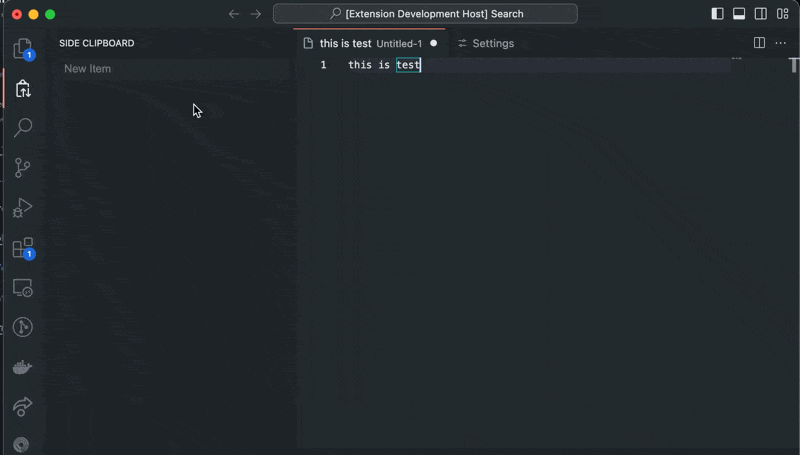

# VSCode Side Clipboard

**Side Clipboard** allows you to register text in VSCode's side menu, enabling you to copy it to the clipboard or paste it into the terminal with just one click.

## Features

### Registering text in Side Clipboard

Text can be registered from the Input in the side menu. You can also use the `Add Item from InputBox` command to instantly register a command.

### Copy to Clipboard

You can copy registered text to the clipboard with a single button click.

### Paste to Terminal

You can instantly paste registered text into the terminal.

